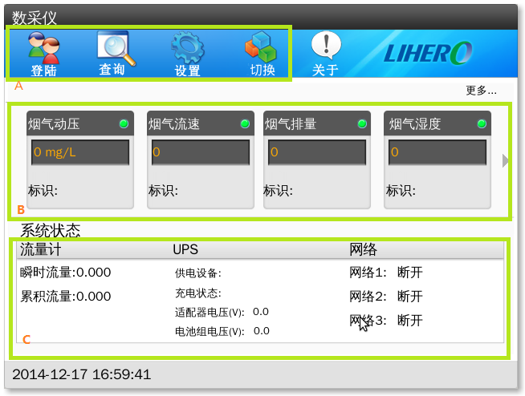
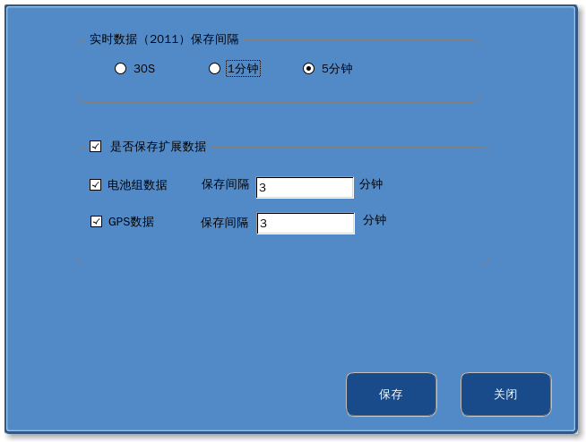
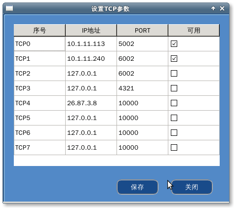
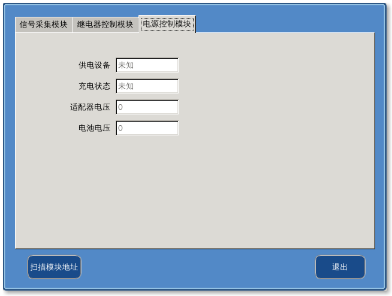
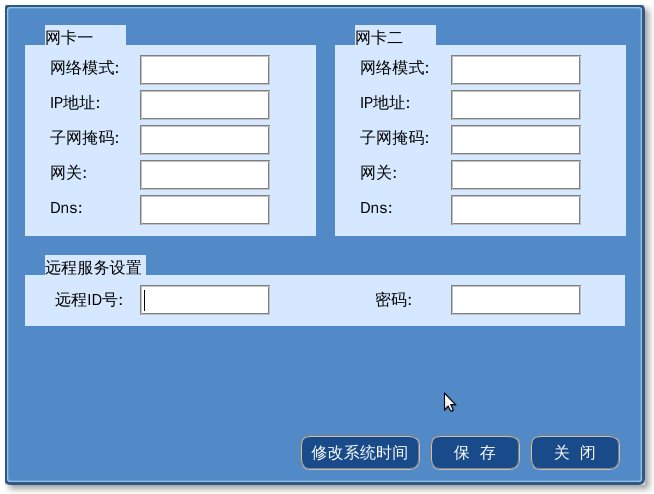

#主界面

各区域功能说明：

* A：登录设置区域
* B：显示实时参数数据
* C：显示实时的系统状态

##登录

###用户权限控制

分成三个等级的用户：

1. 初级权限用户
	
	* 权限： 查询数据
	
	* 初始密码：911456
	
2. 中级权限用户
	
	* 权限： 查询数据，设置
	
	* 初始密码： lhsoft
	

3. 高级权限用户

	* 权限： 查询数据，设置，切换到参数设置界面（能进行参数的添加、删除、属性的更改，以及数采仪的网卡的IP地址的设置等）
	
	* 初始密码： 2021036965

###修改密码

选择对应等级的用户，修改并确认。

##查询

1. 过滤条件

	* 时间段	
		
		点击时间选择控件的向下的箭头弹出时间选择界面，可以按天选择查询的时间段
	
	* 数据类型
		
		点击选择要查询的数据类型，如实时数据、分钟数据、天数据等等
	
	* 字段选择	
		
		勾选要查询的参数名称
		
2. 数据查看
	
	可以上下翻页，跳转到指定的记录条数
		
##设置

###网络设置

1. 此处设置上传的数据平台的网络IP地址、端口号等信息
2. 需勾选是否使用网络信息对应的数据平台

###上传控制

1. 分别针对每个平台控制需要上传的数据类型以及参数

2. 其中每种数据类型只有在保存控制界面中选择保存后才能进行上传控制，否则选择区域会成为灰色，意为不可进行次操作

###数据保存控制

1. 选择是否保存此数据类型

2. 设置数据保存的时间间隔

###质量控制

###烟气参数设置

此处设置的烟气参数可以用来计算烟气数据，有几点需要注意：

1. 速度场系数、排烟口断面面积是必须设置的
2. 当其他参数没有与之对应的参数接入时，此处设置的参数才会参与计算

##参数配置

###串口通信状态
* 一共八个串口，每个串口对应的数采仪上的物理串口的位置可以从附属的文档里查询

* 有3种通信状态，根据颜色区分
	1. 灰色：此串口未使用或者未能正确打开
	2. 黄色：串口已打开但没有传输数据
	3. 绿色且闪烁： 串口正在传输数据

###TCP通信状态
参见串口通信状态说明

###设置仪器参数
>###术语说明：
1. **参数**：要监测的化学物质或者物理参数，如工厂排放的废水中的六价铬浓度，工厂烟气的流速、温度等。
2. **参数属性**：与参数相关的属性，如参数ID、读取参数值所使用的协议等。
3. **仪器**：一台仪器可能会同时监测多个参数
4. **设备地址** 接入数采仪的数据采集模块的Modbus地址

1. 添加参数

	* 点击“添加”按钮，弹出如下界面
	
	
	
	>>####小提示：
	可以双击参数名称添加对应的参数
	
	单击选择要添加的参数按钮，然后点击添加按钮进行添加
	
	* 编辑常用参数列表
	
	点击“编辑常用参数”按钮，弹出如下界面
	
	
	
	此处列出了几乎所有的参数名称及其ID，通过查询找到要添加的参数，然后选择、点击添加或者删除。点击关闭后，右边列表中的参数会出现在添加参数对话框中的“常用参数列表中”。
		
2. 删除参数

	点击删除按钮删除参数
	
3. 设置协议属性
	
	点击右边的“协议”属性栏旁边的设置按钮，会弹出与协议相关的属性的设置对话框
	
	* 对于大部分的协议弹出如下对话框
	
	
	从列表中选择仪器的连接数采仪所用的*串口号*或者*TCP序号*
	
	点击“*设置串口参数*”或者"*设置TCP参数*"按钮（根据协议所用的通信方式的不同会显示不同的按钮），会弹出如下的对话框中的一个：
	
	
	
	在此处可以设置所有的TCP连接和串口的参数，并选择是否可用。
	>>注意：只有当勾选了可用之后，对应的串口或者TCP连接才会出现在选择列表中
	
4. 保存修改

	点击“*保存修改*”按钮保存修改。
	>>提示：无需每修改一个参数就点保存，可以在对所有的修改都完成后一次保存

###设置集成对象
>###术语说明
1. 地址： 模块的Modebus地址
2. 寄存器： 模块的寄存器首地址

###调试

* 信号采集模块调试

这里可以读取**信号采集模块**的八个寄存器（也有叫*通道*的）的*模拟量*以及*采样值*（电流值）。

* 继电器控制模块

调试10个继电器的开关，以及8路开关量的输入

* 电源控制模块

查看电源控制模块的状态，供电设备、适配器和电池电压等信息

###网络及远程设置

此处可以设置或查看数采仪的两个网卡的IP地址，掩码及网关等信息

* 修改系统时间

点击修改系统时间，弹出如下时间设置对话框

###［附］软键盘使用说明

1. 双击要输入数字或者文本的输入框
2. Clear键清除现有文本
3. Enter键完成输入并隐藏软键盘
4. Abc键切换到字母输入软键盘界面